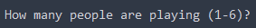
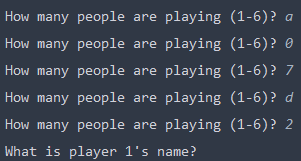
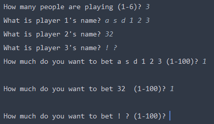
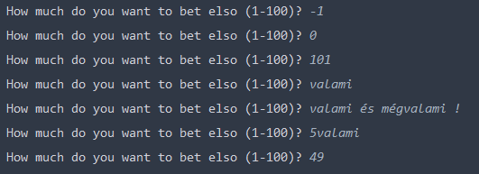
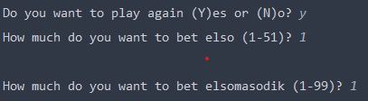
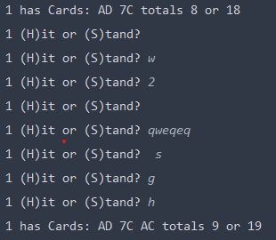

# Manuális tesztelés

###Feladat leírása
Ebben a feladatban a program manuális tesztelését fogom megvalósítani. Ez annyit jelent,
hogy az alkalmazás futtatása során minél szélsőségesebb bemeneteket adok meg, minden létező
helyzetben letesztelve a játékot.

###Az alkalmazás leírása
A játék a blackjack nevű kártyajáték konzolos reprezentációja, amely szabályai egyszerűek:
A felhasználók (1-6 fő) kezdetben 2 kártyalapot kap, az osztó (dealer) is, aki azonban csak 1-et mutat meg.
A cél az, hogy az aktuális felhasználó lapjainak értéke 21, vagy annál kisebb legyen úgy, hogy alulról az ő lapja
közelebb legyen a 21-hez, mint az osztóé. Amennyiben meghaladja a 21-et,
a játékos kiesett a körből és elvesztette a tétjét. A játékos minden körben dönthet, hogy megáll, vagy kér
még egy lapot. A kör végén a játékosok az osztóval versenyeznek. A díler addig hívni fog,
amíg lapjainak értéke kisebb, mint 17. Ha a játékos lapjainak értéke
nagyobb, mint az osztóé, de még 21, vagy az alatti, a játékos a kezdetben megadott tétjét megduplázza.
Amennyiben a játékos "Blackjack"-et ért el (lapjainak értéke pontosan 21), a tét 2.5x-ösét nyeri vissza.
Fordított esetben (amennyiben az osztó lapjainak értéke nagyobb, mint a felhasználóé és 21 vagy az alatti),
a játékos elveszti a feltett tétet.
Az lapok értéke szám esetén értelemszerűen megegyezik a számmal, J, Q és K esetén ez az érték 10,
A esetén pedig lehet 1 és 11 is, függően attól, hogy melyikkel jár jobban a kártya birtokosa.
## Tesztelés
Az alkalmazás indításakor a következő képernyő fogad (a szabályok leírása után): \
 \
A játékosok száma csak 1 és 6 között lehet, annál nagyobb érték nem elfogadható. Egy sztring beadása esetén
szintén új bemenetet vár: \
 \
Miután a játékosok számának bekérése megtörtént, a játékosokhoz tartozó neveket kéri be a játék.
Ennél a lépésnél azt teszteltem, hogy szóközökre, számokra, illetve speciális karakterekre hogyan reagál a
játék. **A sztringekre korábban hibát dobott az alkalmazás, ezt javítottam a BlackjackGame-ben egy if-else ág bevezetésével.**\
 \
\
Mint látható, az első játékos nevében több szóköz is szerepel, amiket ugyan úgy le tud kezelni a játék.
A második játékos neve mögött szintén egy szóköz szerepel, valamint számokat kap. A harmadik játékos nevei
pedig speciális karaktereket tartalmaz.
**Ahhoz, hogy a string-ekre és szóközökre is jól működjön a program, nekem kellett kisebb javításokat végeznem a projektben**, 
a Scanner objektumon egy useDelimeter("\n") függvényt meghívva.\
\
A következő lépés a tétek megadása. Itt is robosztus a szoftver, csak 1 és 100 közötti számokat fogad el.
A 100-as felső határ onnan ered, hogy a játékosok kezdetben 100 zsetont kapnak, amivel fogadni tudnak.
Mint látható, az intervallumon kívüli számokra, sztringekre, olyan sztringekre, melyek számmal kezdődnek
(amelyek benne vannak az intervallumban) nem működik. \
 \
Amenyiben a játékosnak több, vagy kevesebb pénze lesz, mint a kezdeti alap (100), úgy más lesz a kiírandó 
szöveg is: \
 \
\
Ezután kiosztja a díler a kártyákat. A kiosztás teljesen random történik a pakliból. Természetesen,
amennyiben egy lap kiosztásra került, kivételre kerül a pakliból, így nem lehet többször az adott
játszma során kiosztani azt. \
Ezután a játékosoknak egyenként dönteni kell, hogy tovább játszanak-e (Hit), vagy megállnak (Stand).
Ezt a H, vagy az S betűk lenyomásával tehetik meg. Csak és kizárólag ezen betűk valamelyikét lenyomva
enged tovább a játék: \
 \
Mint látható, enter/space billentyű lenyomásakor, hosszabb string beírásakor, vagy szám esetén is a ciklusban maradunk.
**Azt, hogy enter után ne lépjen ki, én javítottam a hitOrStand() függvényben.**
\