# JUnit tesztek hasznossága

### Kezdeti állapot
Kezdetben a projekt nem tartalmazott Unit teszteket, a kód lefedettsége 0 volt. Ezt mutatja
az alábbi ábra is:
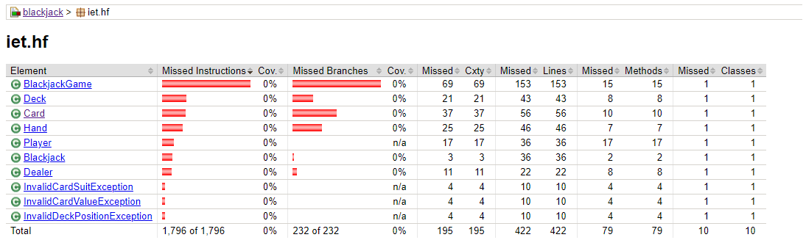 \
Mint látható, mindenhol 0% a lefedettség, ezen szerettünk volna javítani a tesztek segítségével, melyek
nagy segítséget jelentenek a fejlesztők számára a későbbi fejlesztések során.

### Card osztály tesztelése
Az első tesztelt osztály a Card osztály volt. Az alábbi ábra mutatja, hogy itt a kódlefedettség 
jóval megnőtt, közel 100%.
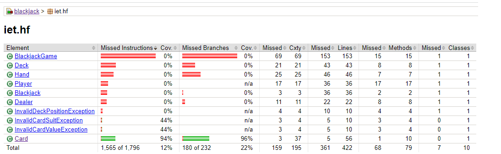 \
Az osztály belseje tesztek szempontjából így néz ki:
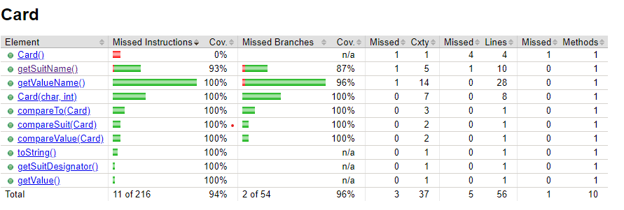 

### Dealer osztály tesztelése
A következő osztály, melyhez készítve lettek tesztek a Dealer osztály volt. Itt a lefedettség 86%.
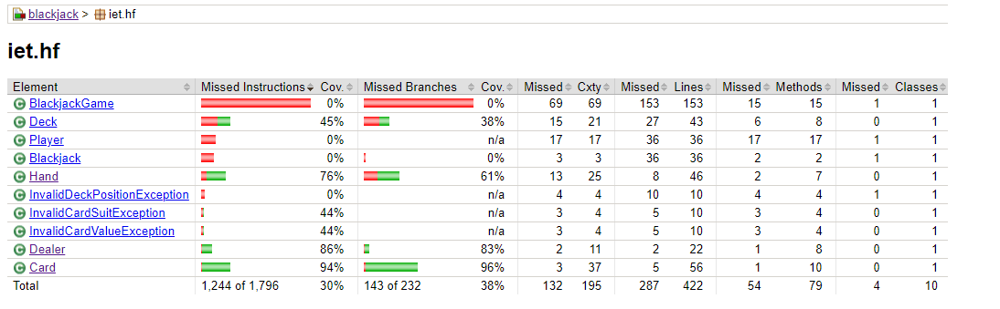 \
Belülről:
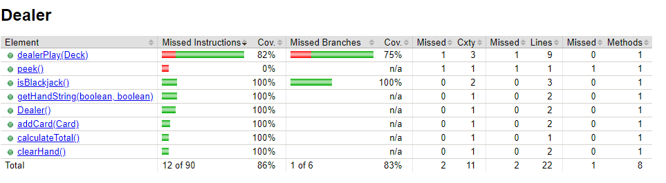 

### Deck osztály tesztelése
Ezután jött a Deck osztályhoz készültek el a tesztek, 76%-os lefedettséget eredményezve.
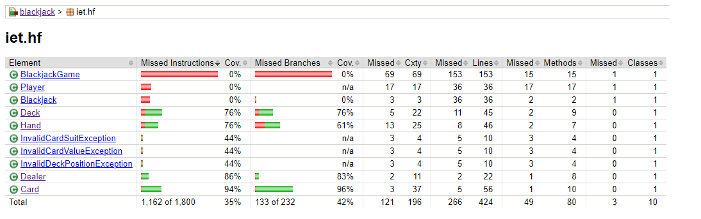 \
Függvények lefedettsége:
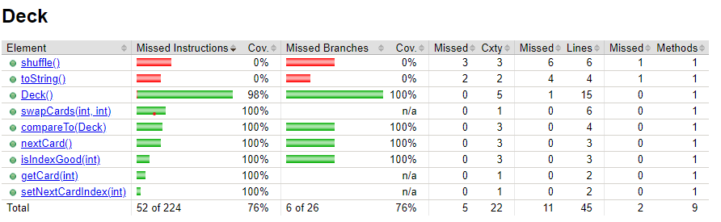 

### Hand osztály tesztelése
Ezt követően a Hand osztályhoz tartalmazó teszteket írtuk meg. Itt 85%-os lefedettséget tudtunk elérni:
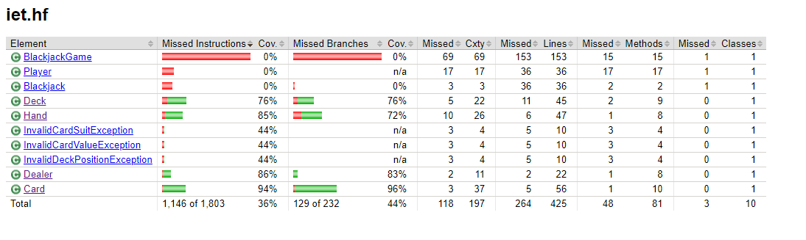 \
A függvények és azok lefedettsége:
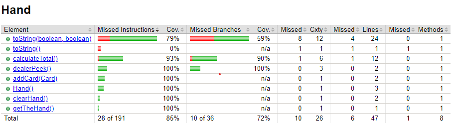 

### Player osztály tesztelése
Végül az utolsó tesztelt osztály a Player volt. Itt is 80% feletti a code coverage.
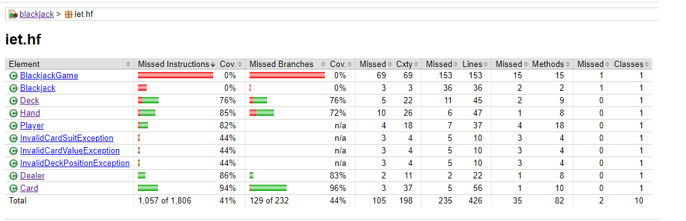 \
A függvények és azok lefedettsége:
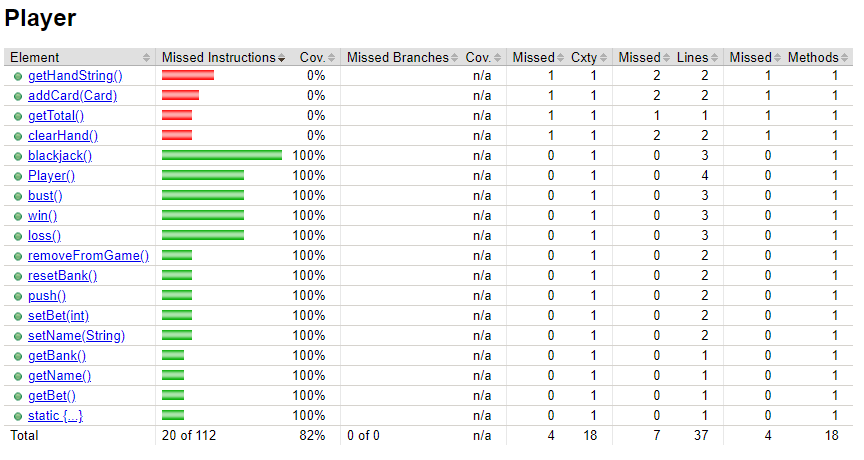 

\
**Összességében a kód lefedettsége 0%-ról 42%-ra emelkedett, ezzel elősegítve a további fejlesztéseket.**
**Fontos kiemelni, hogy az exception osztályok tesztelhetetlensége eléggé lehúzza ezt az átlagot.**
**Ezen kívül a BlackjackGame osztály függvényei felhasználói interakciókra alapoznak, így azt unit tesztekkel nem célszerű tesztelni.**
